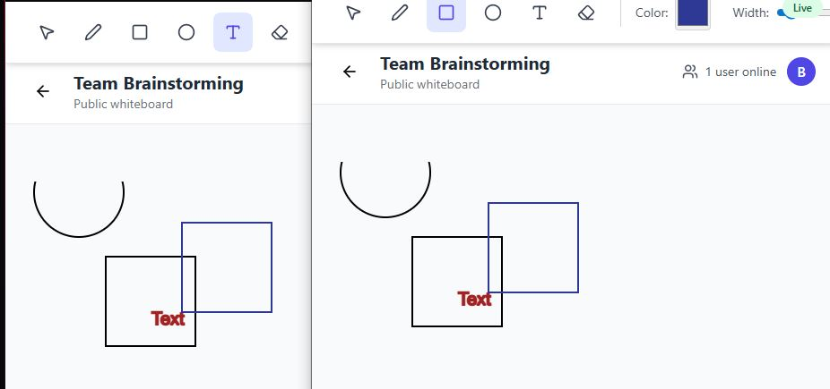
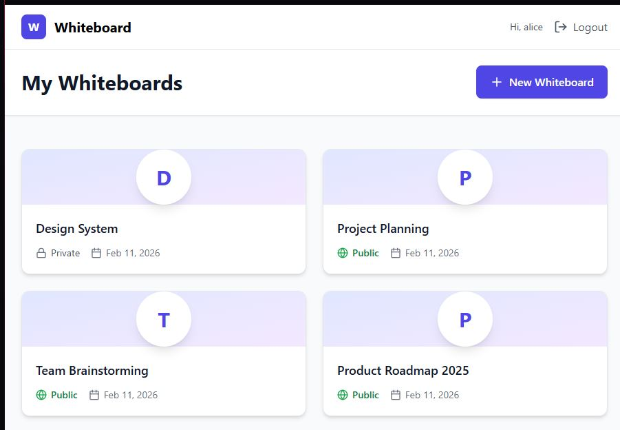
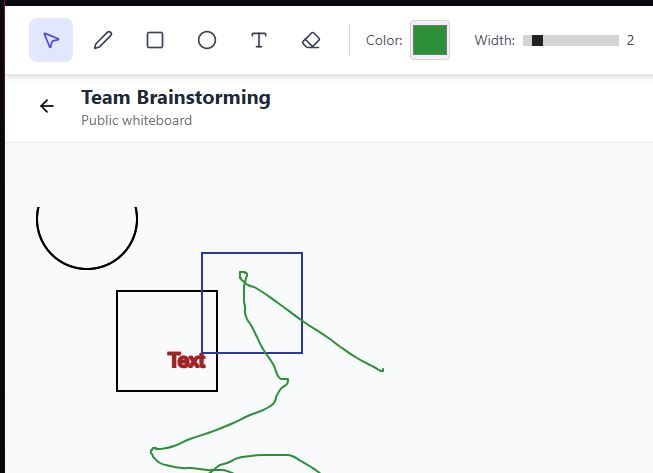

# Collaborative Whiteboard
A modern, interactive online whiteboard where multiple users can draw, add shapes, write text, and brainstorm together.


## Key Features

1. Real-Time Collaboration

Multiple users can draw simultaneously on the same whiteboard.
Changes are synced instantly using WebSockets.




2. Room-Based Sessions

Users can create or join whiteboard rooms.
Each room maintains its own isolated drawing state.




3. Drawing Tools

- Freehand drawing
- Color selection
- Brush size adjustment
- Eraser tool
- Clear canvas option




4. Persistent Board State

Board content is saved and restored when users reconnect.

5. User Roles & Permissions

Control who can:
- Draw
- Clear the board
- Manage the session

6. Responsive & Modern UI

- Clean interface
- Mobile-friendly layout

7. WebSocket-Based Architecture

Real-time communication powered by FastAPI WebSocket backend.
Efficient event broadcasting for low-latency updates.


## Technologies
- Backend: [![Python]][Python-url] [![Django]][Django-url] [![DRF]][DRF-url] [![FastAPI]][FastAPI-url] [![WebSocket]][WebSocket-url]
- Frontend: [![React]][React-url] [![TypeScript]][TypeScript-url] [![Vite]][Vite-url] [![Tailwind]][Tailwind-url]
- Database: [![Postgres]][Postgres-url]
- DevOps: [![Docker]][Docker-url] [![Nginx]][Nginx-url]
- [![Git]][Git-url]


## Installation

This project can be started locally using Docker.

### Prerequisites
- Docker (with Docker Compose support)

### Running the application

1. Start Docker.
2. Open a terminal in the project root directory.
3. Run:

   ```bash
   docker compose up
    ```
    or, if you need to rebuild the image:

   ```bash
   docker compose up --build
    ```
4. After the containers are running, the application will be available at:

    http://localhost:80

5. Demo users (if available) can be found in the container logs, or you can create your own account.

### Accessing from Local Network

To access the application from another device on the same network:

1. Make sure port 80 is allowed through your firewall.

2. Find your host machine's IP address:
   ```bash
   ipconfig
   ```
3. Open the application in a browser:
   ```cpp
   http://<your_host_ip>:80
   ```
### How to stop the app

   ```bash
   docker compose down
   ```
or, if you need to remove volumes:

   ```bash
   docker compose down -v
   ```


[Postgres]: https://img.shields.io/badge/Postgres-%23316192.svg?logo=postgresql&logoColor=white
[Postgres-url]: https://www.postgresql.org/

[Docker]: https://img.shields.io/badge/Docker-2496ED?logo=docker&logoColor=fff
[Docker-url]: https://www.docker.com/

[React]: https://img.shields.io/badge/React-%2320232a.svg?logo=react&logoColor=%2361DAFB
[React-url]: https://react.dev/

[Vite]: https://img.shields.io/badge/Vite-646CFF?logo=vite&logoColor=fff
[Vite-url]: https://vite.dev/guide/

[CSS]: https://img.shields.io/badge/CSS-1572B6?logo=css3&logoColor=fff
[CSS-url]: https://en.wikipedia.org/wiki/CSS

[JavaScript]: https://img.shields.io/badge/JavaScript-F7DF1E?logo=javascript&logoColor=000
[JavaScript-url]: https://en.wikipedia.org/wiki/JavaScript

[Git]: https://img.shields.io/badge/Git-F05032?logo=git&logoColor=fff
[Git-url]: https://git-scm.com/

[TypeScript]: https://img.shields.io/badge/TypeScript-blue?logo=typescript&logoColor=white
[TypeScript-url]: https://www.typescriptlang.org

[Django]: https://img.shields.io/badge/Django-092E20?logo=django&logoColor=white
[Django-url]: https://www.djangoproject.com

[DRF]: https://img.shields.io/badge/DRF-ff1709?logo=django&logoColor=white&label=DRF
[DRF-url]: https://www.django-rest-framework.org

[JWT]: https://img.shields.io/badge/JWT-000000?logo=jsonwebtokens&logoColor=white
[JWT-url]: https://jwt.io

[FastAPI]: https://img.shields.io/badge/FastAPI-009688?logo=fastapi&logoColor=white
[FastAPI-url]: https://fastapi.tiangolo.com/

[Tailwind]: https://img.shields.io/badge/Tailwind_CSS-38B2AC?logo=tailwind-css&logoColor=white
[Tailwind-url]: https://tailwindcss.com/

[Nginx]: https://img.shields.io/badge/Nginx-009639?logo=nginx&logoColor=white
[Nginx-url]: https://nginx.org/

[Python]: https://img.shields.io/badge/Python-3776AB?logo=python&logoColor=white
[Python-url]: https://www.python.org/

[WebSocket]: https://img.shields.io/badge/WebSocket-010101?logo=socketdotio&logoColor=white
[WebSocket-url]: https://developer.mozilla.org/en-US/docs/Web/API/WebSockets_API
